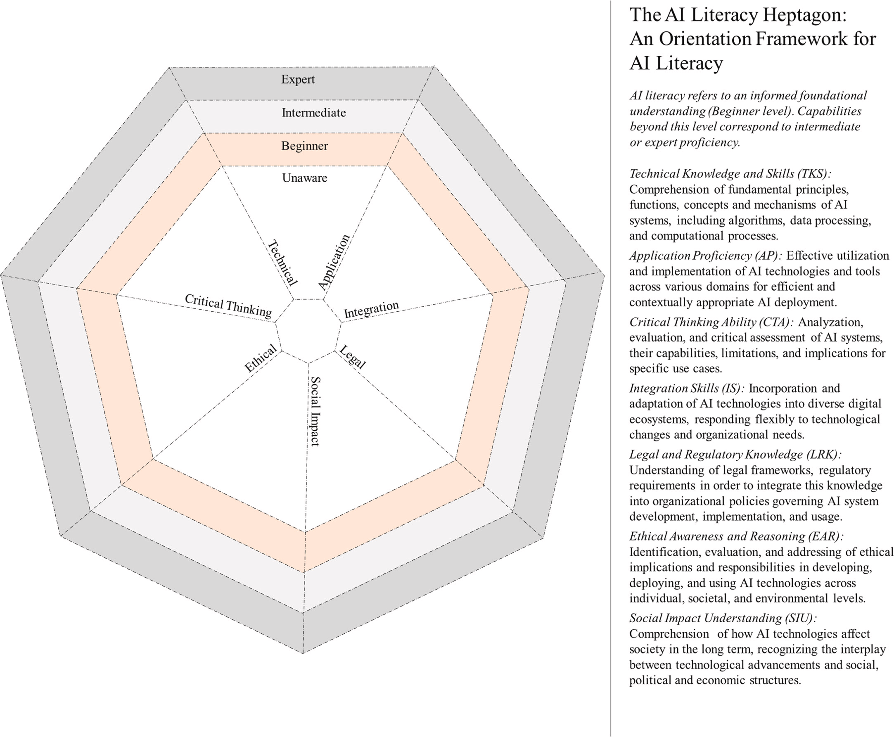

# Comprendre les LLMs 

## 3blue1brown 

Une chaîne YouTube qui explique les `grands concepts mathématiques` de manière visuelle et intuitive. Il a une série de vidéos sur le *deep learning* et les LLMs. Elles sont très utiles pour comprendre comment les LLMs fonctionnent, bien qu'elles soient assez techniques.

Voir Chapitres 4, 5 et 6 de la série. 

> Site web: [3blue1brown](https://www.3blue1brown.com/?topic=neural-networks)

# Utiliser les LLMs pour l'enseignement

## FUN / CNAM 

Conçu par Cécile Dejoux, Professeur des universités au Cnam, un MOOC destiné à explorer des `cas d'usage de l'IA` dans différentes professions. Comprend également des fiches ressources outils et des videos mode d’emploi. 

> Site web: [FUN / CNAM](https://www.fun-mooc.fr/fr/cours/pratiquer-lia-utile/)
>
> En parallèle du [site de Cécile Dejoux](https://www.ceciledejoux-ia.com/).

## URFIST / PSL 

`Supports de formation` proposés par Aline Bouchard (03/2026). Il s'agit d'un document conséquent (257p) revenant sur l'état des lieux, les utilisations possibles, des compétences, des cas, etc. 

> Site web: [URFIST / PSL.](https://urfist.chartes.psl.eu/ressources/former-les-usagers-l-heure-de-chatgpt-ia-et-competences-informationnelles-formation-de)
>
> Lien direct vers le support de formation "Former les usagers à l'heure de ChatGPT : IA et compétences informationnelles (formation de formateurs)" (05/2026): [PDF.](https://urfist.chartes.psl.eu/sites/urfist/files/public/media/document/2026-05/Bouchard_URFIST-Paris_ChatGPT-pedagogique_04052026.pdf)

## IA SUP - L'Université Numérique

Une plateforme du Ministère Chargé de l'Enseignement Supérieur et de la Recherche, de France Université Numérique et de l'Université Numériques proposant des ressources pour comprendre et utiliser l'IA dans l'enseignement supérieur.

> [Les ressources pour enseigner](https://luniversitenumerique.fr/ia-sup-ressource-intelligence-artificielle/ia-sup-ia-dans-lenseignement-superieur-ressources-pour-enseigner/)
> 
> [Les guides d'usage](https://luniversitenumerique.fr/ia-sup-ressource-intelligence-artificielle/ia-sup-ia-dans-lenseignement-superieur-guides-dusages/)

## Brevet AI - Université Paris Saclay 

Partenariat entre Université Paris Saclay, ENS Saclay, DATAIA, Brevet AI et France 2030, le MOOC contient 4 cours spécifique pour progresser dans son usage des IA : 

* Comment fonctionne l'IA 
* Les tâches de l'IA
* L'IA en pratiques / Les bonnes pratiques 
* Les problèmes sociétaux de l'IA

Une ressource à déployer dans les établissements. 

> [Le MOOC](https://brevetai.fr/en#presentation)

## AI Literacy Heptagon

Un travail de science de l'éducation à paraître en juin 2026, proposant une revue de littérature sur l'usage de l'IA dans l'enseignement supérieur, ainsi qu'un outil synthétique - le `*AI literacy heptagon*`. Celui-ci tient compte de la manière dont l'*AI literacy* vient prolonger les efforts déjà entrepris en terme de *Media literacy*, *Data literacy* et *Computational literacy*. 

> Veronika Hackl, Alexandra Elena Müller, Maximilian Sailer (2026), "The AI literacy heptagon: A structured approach to AI literacy in higher education", *Computers and Education: Artificial Intelligence*, Volume 10, [https://doi.org/10.1016/j.caeai.2026.100540](https://doi.org/10.1016/j.caeai.2026.100540).

# Utiliser les LLMs en cours

## Propositions de bonnes pratiques 

1. **Mise en place d'une `«annexe IA»` dans les rendus demandés aux étudiant·e·s** 
	- Quel a été votre usage de l'IA dans la réalisation de ce travail ?
	- Êtes vous satisfait·e de la manière dont vous avez eu recours à l'IA ? 
	- Que pourriez vous faire autrement à l'avenir ? 
	- Indiquez, le cas échéant, les prompts et les modèles que vous avez utilisé. 
  
2. **Demander aux étudiant·e·s de `partager les prompts` qu'ils ont utilisés**.  
    - Insister notamment sur le fait de devoir faire 7 ou 8 itérations dans les échanges avec l'IA afin d'obtenir des résultats adéquats et de pousser l'esprit critique.
  
3. **Souligner l'importance d'un `usage authentique de la langue` dans les rendus**. 
    - Cela afin de pousser les étudiant·e·s à réfléchir aux usages sociaux de la langue, de leur demander de prendre en compte le registre adapté à chaque exercice, et de nous fournir des appuis lorsque nous réagissons à la forme des rendus.
  
4. **Proposer un travail de `comparaisons d'exemples`, en contrastant les mauvais exemples réalisés par IA et les bons exemples réalisés par des humains**. 
    - Un travail qui peut s'appliquer au design, à la sémio, à la création de visuels, à la veille, aux exercices de rédactions, etc. 
  
5. **Mettre en place une `présentation/contextualisation de la charte IA` (charte du département) en début d'année :**
    - Par les responsables à l'ensemble de la promotion. 
    - Par les chargé·e·s de cours en début de semestre. 

        Cela implique également une charge d'exemplarité de notre part au regard du respect de la charte IA. 

6. **En parallèle de ces approches en terme de compétences, renforcer les modules permettant de déployer `une distance critiques vis-à-vis de l'IA`**, notamment en matière de : 

    - RSE/RSO
    - transformations de l'organisation du travail
    - impact environnemental 
    - histoire des médias
    - risques psycho-sociaux
    - culture numérique
    - évolution des missions stratégiques et créatives
    - distanciation vis-à-vis du déterminisme technologique et du relativisme technologique

## Charte du département Information-Communication - IUT Paris Rives de Seine

    Département Information-Communication
    Charte éthique relative aux Intelligences Artificielles

    Préambule
    
    L'inflation de contenus de faible qualité génère de la confusion, et détruit de la valeur : la valeur réside 
    dans la capacité à trier et sélectionner ce qui est pertinent dans un cas précis, dans une problématique située. 
    En outre, les rapports sociaux sont basés sur la confiance et les rapports professionnels ont une dimension 
    contractuelle : l'usage de l'IA non déclaré est une tromperie, qui contrevient à l'éthique comme aux 
    engagements contractuels vis-à-vis de l'employeur ou du client.

    Étudiant en Infocom à l’IUT Paris Rives de Seine, 
    
    • Quand j'utilise l'IA, je le dis, et je précise pour quoi faire. 
    
    • Je ne rends jamais à un enseignant ou un employeur une production d'IA non révisée, non expurgée. 
    Si l'enseignant estime qu'il est de mon intérêt d'avoir recours à l'IA pour un aspect du travail, 
    il me le fera savoir.
    
    • J’ai conscience qu'un enseignant peut refuser d'employer son temps à corriger une production pour 
    laquelle j'ai utilisé l'IA pour économiser le mien. 
    
    • De même que je ne m'approprie pas le travail de mes camarades, je ne prétends pas avoir fait moi-même 
    ce que j'ai fait faire, d’autant que les LLM reposent sur des données produites par d’autres 
    êtres humains, le plus souvent non crédités. 
    
    • Ce que j'écris est de ma totale responsabilité : je serai donc légitimement jugé·e sur l'originalité, 
    l'authenticité et la vérité de mes écrits, et j'assume les conséquences en termes de réputation 
    et de confiance si je fais passer pour miens des propos que je n’ai pas produits, ou si ces propos 
    sont erronés, fautifs ou aberrants. 
    
    • Je suis conscient·e que demander à une IA de fabriquer des sources fictives, chiffres, études, est 
    une faute grave, qui peut avoir des conséquences juridiques, à l’université comme en entreprise. 
    
    • Je ne fournis pas à l'IA des données, cours, PowerPoint qui ne m'appartiennent pas et dont les 
    auteurs n'ont pas consenti à cet usage.

