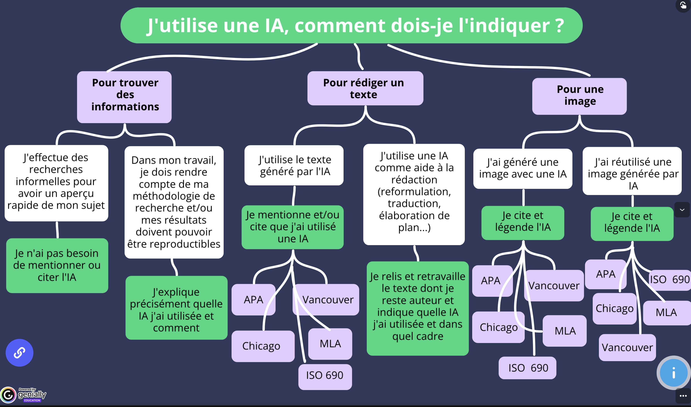

# Mieux comprendre l'IA

## IA SUP - L'Université Numérique 

Des ressources introductives pour les étudiant·e·s, comprenant à l'heure actuelle (05/2026) un module de l'Université Bretagne Sud et un MOOC de l'Université d'Avignon. 

> [Le site](https://luniversitenumerique.fr/ia-sup-ressource-intelligence-artificielle/ia-sup-ia-dans-lenseignement-superieur-ressources-introductives-pour-les-etudiants/)

On y trouve également des ressources «formation», comprenant des informations sur le référentiel PIX, le Moodle de l'Université Paris Saclay, ou encore le référentiel de l'UNESCO. 

> [Ressources Formation](https://luniversitenumerique.fr/ia-sup-ressource-intelligence-artificielle/ia-sup-ia-dans-lenseignement-superieur-formation-pour-les-etudiants/)

# Mieux utiliser l'IA

## Arbre décisionnel

Un arbre décisionnel pour expliquer aux étudiants quand et comment documenter leur usage de l'IA. Produit par l'Université de Nantes.

> [L'arbre](https://view.genially.com/65dcaa27ad0c8600147a8630)

## No-Vibe Guide to LLMs 

Un guide pour comprendre les LLMs, avec des explications claires et des exemples concrets. Il est conçu pour être accessible à tous, même ceux qui n'ont pas de connaissances techniques approfondies. Composé par Pedro Morales-Almazan, professeur de Mathématiques à l'Université de Santa-Cruz. 

> Le [site web](https://p3d40.github.io/).
>
>Voir surtout : 
>- [La page sur les 'best practices'](https://p3d40.github.io/week6.html)
>
>- [La page sur les 'tips, tricks and useful prompts'](https://p3d40.github.io/week8.html)

On trouve par exemple l'échelle "TRUST" que Morales-Almazan propose pour évaluer votre niveau de réflexivité sur votre usage de l'IA - ou celui des étudiant·e·s - lorsque celle-ci est intégré à des pratiques de travail : 

| Étape        | Dimension              | Description                                                                                                         |
| ------------ | ---------------------- | ------------------------------------------------------------------------------------------------------------------- |
| Entraînement | Données (1 pt)         | Évaluer les sources de données, leur qualité, les droits d'auteur et la vie privée liés aux données d'entraînement. |
| Entraînement | Empreinte (1 pt)       | Prendre en compte l'impact environnemental et humain du LLM.                                                        |
| Traitement   | Explicabilité (3 pts)  | Dans quelle mesure l'utilisateur comprend-il les résultats produits.                                                |
| Traitement   | Vie privée (3 pts)     | Évalue les pratiques de propriété, de stockage et d'utilisation des données.                                        |
| Évaluation   | Évaluation (9 pts)     | Mesure l'efficacité et la précision des résultats produits.                                                         |
| Évaluation   | Responsabilité (9 pts) | Garantit une responsabilité humaine claire à chaque étape du processus.                                             |

Cela permet ainsi d'obtenir un score final. Morales-Almazan propose des actions concrètes en fonction de ce score :

| Niveau         | Score       | Action                                                                                                                        |
| -------------- | ----------- | ----------------------------------------------------------------------------------------------------------------------------- |
| High TRUST     | > 18 pts    | Mettre en œuvre le système tout en réévaluant périodiquement si l'une des dimensions a évolué.                                |
| Moderate TRUST | 13 à 18 pts | Identifier et corriger les faiblesses dans les étapes les moins bien notées. Réévaluer avant de mettre en œuvre le système.   |
| Low TRUST      | 5 à 2 pts   | Revoir toutes les étapes du système pour vérifier leur conformité aux politiques et réglementations en vigueur.               |
| Minimal TRUST  | < 5 pts     | Envisager une refonte du système et/ou explorer une alternative. Consulter les responsables et rechercher d'autres solutions. |