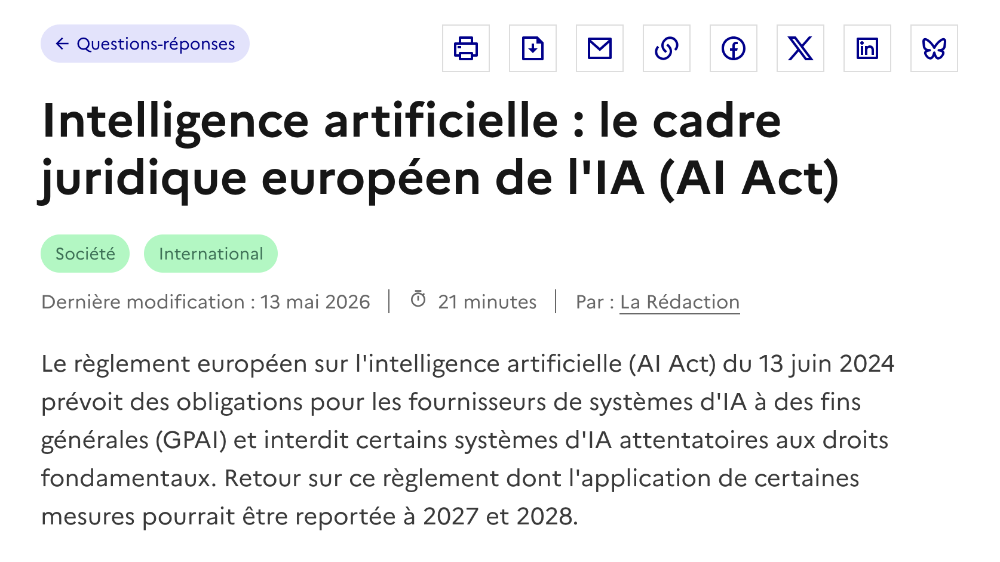

# France 

# Europe

## AI Act (Juin 2024)

Le règlement européen sur l'intelligence artificielle (AI Act) du 13 juin 2024 prévoit des obligations pour les fournisseurs de systèmes d'IA à des fins générales (GPAI) et interdit certains systèmes d'IA attentatoires aux droits fondamentaux.

À l'heure actuelle l'application de ces mesures est encore à venir. 

> Présentation sur [Vie Publique.](https://www.vie-publique.fr/questions-reponses/292157-ai-act-le-reglement-europeen-sur-lintelligence-artificielle-ia)
>
> Le texte sur le site de [l'Union Européenne.](https://eur-lex.europa.eu/eli/reg/2024/1689/oj/eng)