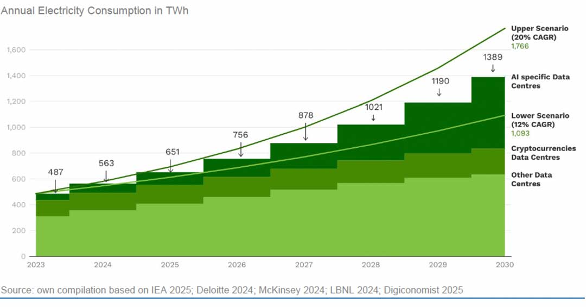

# Impact écologique de l'IA

## Greenpeace - Jens Gröger et al. - Environmental Impacts of Artificial Intelligence

Un rapport publié en Mai 2025 sur les conséquences environnementales du développement de l'intelligence artificielle. Il revient d'abord sur les grands acteurs du secteur et la multiplication des centres de données qui accompagnent l'essor de l'IA. Le rapport précise ensuite les conséquences de cette croissance en terme de consommation d'énergie, d'émission de gaz à effet de serre, de consommation d'eau, et de lien avec le secteur du nucléaire. 

Les auteurs soulignent par ailleurs 5 enjeux centraux pour une meilleure prise en compte des enjeux environnementaux dans la régulation de l'IA : 

1. Des amendements à la législation en matière d'environnement pour encadrer les risques liés à l'IA
2. Un accès facilité aux données privés pour une analyse scientifique des conséquences environnementales, et en particulier des effets indirects, de l'IA
3. Un renforcement des obligations en matière d'analyse des risques et d'encadrement lorsque l'IA est utilisé dans des «domaines écologiquement sensibles»
4. Un renforcement des obligations en matière de gouvernance des données dans le cadre de l’entraînement des IA
5. La formalisation d'une procédure d'analyse d'impact permettant de préciser l'impact environnemental des IA avant leur déploiement

> [Le Rapport (PDF)](https://www.greenpeace.org.au/static/planet4-australiapacific-stateless/2026/04/20d05564-report-environmental-imapcts-of-ai.pdf)
>
> [Présentation du rapport]()

# Impact de l'IA sur l'organisation du travail 